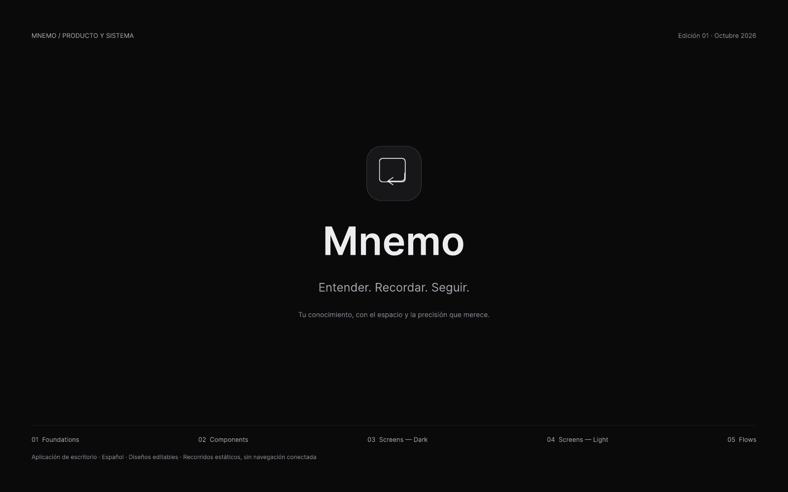
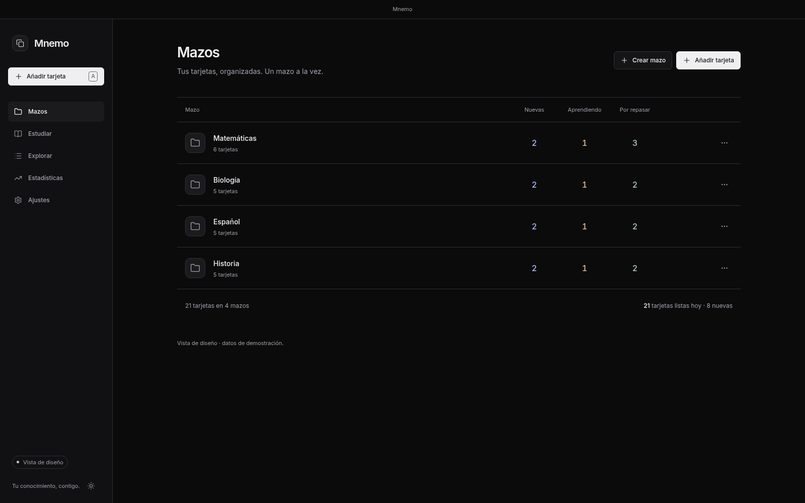

# UI QA report

The supplied reference is a **single cover page**, not a set of application frames. The Figma URL and node IDs in the brief are placeholders. No screen-level pixel match is claimed. All screens below are derived from the cover's neutral visual language and checked against the requested flashcard workflow.

**Deviates*** means exact reference matching is **unverified because the corresponding screen frame was not supplied**. It does not mean an available Figma frame was ignored. Exact spacing, fonts, light-theme colors and missing component states need comparison again once those frames exist. Details are recorded in [UI notes](ui-notes.md).

## Available visual reference

| Supplied cover                                     | Derived Mazos screen                                       |
| -------------------------------------------------- | ---------------------------------------------------------- |
|  |  |

The cover establishes dark grayscale, restrained card imagery, sans-serif type, ample whitespace and fine dividers. The application preserves those characteristics while using the brief's deck rows and reviewer structure. The cover is not recreated as a dashboard or marketing screen.

## Validation

- **11 Vitest tests passed**: persistence, v1-to-deck migration, migration write failure, deck moves/deletion, count eligibility, input validation, appearance preference and desktop payload constraints.
- Strict TypeScript and production build passed.
- **78 browser screenshots** at **1600×1000**, matching the supplied PDF page size. Fonts and icons are local. Reduced motion and disabled screenshot animations stabilize captures. All six card types, both themes, every verdict, loading fallback, source sheets, selection explanation, quick edit, suggested connections, reinforcement and summary are covered.
- Browser checks cover batch add with cleared fields, KaTeX preview, connection confirmation, Space reveal, 1–4 ratings, user verdict correction, retirement after the second report, reinforcement insertion, grading cancellation/self-rating, exit confirmation and one-card session completion.
- Appearance checks include Light/Dark changes and **System** responding to OS preference changes and reload. Editor save shortcuts do not submit the reviewer underneath.
- Electron smoke passed with a temporary local profile: secure window preferences, no renderer Node or mock API, HTTPS-only external handling, deck/card creation, quick edit during study, source KaTeX, keyboard reveal/rating, stored activity, batch add, theme persistence and no backend files created.
- Production assets exclude the mock installer and fixture IDs. Production uses local recall cards only; adding the mock query parameter cannot enable fixtures.

The isolated browser/Electron drivers use test-only sandbox bypasses on this managed host. This is not evidence of Chromium OS sandbox enforcement. macOS native traffic lights and Windows chrome require checks on their respective hosts.

## Corrections during visual QA

- Centered editor dialogs explicitly after Tailwind reset their browser margins.
- Aligned browse filters with the search row and table.
- Moved component dimensions and remaining effect colors into tokens; only media-query breakpoints remain literal CSS dimensions.
- Adjusted dim text colors for readable Light/Dark secondary labels.
- Preserved native keyboard activation of focused controls.
- Isolated Ctrl/⌘Enter in quick-edit dialogs from reviewer submission.
- Refreshed the current local card's front immediately after quick editing.
- Captured at the reference viewport size instead of stretching long pages into full-page images.

## Flashcard litmus test

| Screen   | Verdict                                                                                     |
| -------- | ------------------------------------------------------------------------------------------- |
| Mazos    | Pass: deck rows, card counts and Study actions immediately establish the flashcard library. |
| Resumen  | Pass: one deck, three counts and one Study action make the next step explicit.              |
| Estudiar | Pass: a large centered question, reveal and four ratings dominate the screen.               |
| Añadir   | Pass: deck selector, front/back fields and batch entry read as a flashcard editor.          |

## Reproduce

Run `npm run dev:ui`, then `npm run test:ui`. The script writes the screenshots and their manifest. Configure `CHROMIUM_EXECUTABLE` or `UI_QA_URL` if needed. For Electron, build first and run `npm run test:electron` with an available display.

Remaining visual blocker: actual Figma/exported application screen references. Remaining service blocker: the previously removed backend. Real generation, verification, scheduling and automated grading are not reintroduced by this renderer task.

## Screens and states

An additional [Electron local-data capture](ui-qa/electron-local-light.png) records the real desktop shell at its restored/default window size. The browser fixtures and local production behavior are documented separately.

| Screen/state                   | Dark capture                                          | Light capture                                           | Functional QA | Reference status |
| ------------------------------ | ----------------------------------------------------- | ------------------------------------------------------- | ------------- | ---------------- |
| add-empty                      | [Dark](ui-qa/add-empty-dark.png)                      | [Light](ui-qa/add-empty-light.png)                      | Passed        | Deviates*        |
| add-preview                    | [Dark](ui-qa/add-preview-dark.png)                    | [Light](ui-qa/add-preview-light.png)                    | Passed        | Deviates*        |
| browse-default                 | [Dark](ui-qa/browse-default-dark.png)                 | [Light](ui-qa/browse-default-light.png)                 | Passed        | Deviates*        |
| browse-detail                  | [Dark](ui-qa/browse-detail-dark.png)                  | [Light](ui-qa/browse-detail-light.png)                  | Passed        | Deviates*        |
| decks-default                  | [Dark](ui-qa/decks-default-dark.png)                  | [Light](ui-qa/decks-default-light.png)                  | Passed        | Deviates*        |
| decks-empty                    | [Dark](ui-qa/decks-empty-dark.png)                    | [Light](ui-qa/decks-empty-light.png)                    | Passed        | Deviates*        |
| decks-generating               | [Dark](ui-qa/decks-generating-dark.png)               | [Light](ui-qa/decks-generating-light.png)               | Passed        | Deviates*        |
| decks-no-key                   | [Dark](ui-qa/decks-no-key-dark.png)                   | [Light](ui-qa/decks-no-key-light.png)                   | Passed        | Deviates*        |
| decks-offline                  | [Dark](ui-qa/decks-offline-dark.png)                  | [Light](ui-qa/decks-offline-light.png)                  | Passed        | Deviates*        |
| overview-default               | [Dark](ui-qa/overview-default-dark.png)               | [Light](ui-qa/overview-default-light.png)               | Passed        | Deviates*        |
| settings-advanced              | [Dark](ui-qa/settings-advanced-dark.png)              | [Light](ui-qa/settings-advanced-light.png)              | Passed        | Deviates*        |
| settings-default               | [Dark](ui-qa/settings-default-dark.png)               | [Light](ui-qa/settings-default-light.png)               | Passed        | Deviates*        |
| stats-default                  | [Dark](ui-qa/stats-default-dark.png)                  | [Light](ui-qa/stats-default-light.png)                  | Passed        | Deviates*        |
| study-cloze-feedback           | [Dark](ui-qa/study-cloze-feedback-dark.png)           | [Light](ui-qa/study-cloze-feedback-light.png)           | Passed        | Deviates*        |
| study-cloze-front              | [Dark](ui-qa/study-cloze-front-dark.png)              | [Light](ui-qa/study-cloze-front-light.png)              | Passed        | Deviates*        |
| study-cloze-source             | [Dark](ui-qa/study-cloze-source-dark.png)             | [Light](ui-qa/study-cloze-source-light.png)             | Passed        | Deviates*        |
| study-complete                 | [Dark](ui-qa/study-complete-dark.png)                 | [Light](ui-qa/study-complete-light.png)                 | Passed        | Deviates*        |
| study-exit-confirmation        | [Dark](ui-qa/study-exit-confirmation-dark.png)        | [Light](ui-qa/study-exit-confirmation-light.png)        | Passed        | Deviates*        |
| study-explain-feedback         | [Dark](ui-qa/study-explain-feedback-dark.png)         | [Light](ui-qa/study-explain-feedback-light.png)         | Passed        | Deviates*        |
| study-explain-front            | [Dark](ui-qa/study-explain-front-dark.png)            | [Light](ui-qa/study-explain-front-light.png)            | Passed        | Deviates*        |
| study-explain-source           | [Dark](ui-qa/study-explain-source-dark.png)           | [Light](ui-qa/study-explain-source-light.png)           | Passed        | Deviates*        |
| study-fail-reinforcement       | [Dark](ui-qa/study-fail-reinforcement-dark.png)       | [Light](ui-qa/study-fail-reinforcement-light.png)       | Passed        | Deviates*        |
| study-loading                  | [Dark](ui-qa/study-loading-dark.png)                  | [Light](ui-qa/study-loading-light.png)                  | Passed        | Deviates*        |
| study-mcq-feedback             | [Dark](ui-qa/study-mcq-feedback-dark.png)             | [Light](ui-qa/study-mcq-feedback-light.png)             | Passed        | Deviates*        |
| study-mcq-front                | [Dark](ui-qa/study-mcq-front-dark.png)                | [Light](ui-qa/study-mcq-front-light.png)                | Passed        | Deviates*        |
| study-mcq-source               | [Dark](ui-qa/study-mcq-source-dark.png)               | [Light](ui-qa/study-mcq-source-light.png)               | Passed        | Deviates*        |
| study-numeric_problem-feedback | [Dark](ui-qa/study-numeric_problem-feedback-dark.png) | [Light](ui-qa/study-numeric_problem-feedback-light.png) | Passed        | Deviates*        |
| study-numeric_problem-front    | [Dark](ui-qa/study-numeric_problem-front-dark.png)    | [Light](ui-qa/study-numeric_problem-front-light.png)    | Passed        | Deviates*        |
| study-numeric_problem-source   | [Dark](ui-qa/study-numeric_problem-source-dark.png)   | [Light](ui-qa/study-numeric_problem-source-light.png)   | Passed        | Deviates*        |
| study-open_problem-feedback    | [Dark](ui-qa/study-open_problem-feedback-dark.png)    | [Light](ui-qa/study-open_problem-feedback-light.png)    | Passed        | Deviates*        |
| study-open_problem-front       | [Dark](ui-qa/study-open_problem-front-dark.png)       | [Light](ui-qa/study-open_problem-front-light.png)       | Passed        | Deviates*        |
| study-open_problem-source      | [Dark](ui-qa/study-open_problem-source-dark.png)      | [Light](ui-qa/study-open_problem-source-light.png)      | Passed        | Deviates*        |
| study-partial                  | [Dark](ui-qa/study-partial-dark.png)                  | [Light](ui-qa/study-partial-light.png)                  | Passed        | Deviates*        |
| study-quick-edit               | [Dark](ui-qa/study-quick-edit-dark.png)               | [Light](ui-qa/study-quick-edit-light.png)               | Passed        | Deviates*        |
| study-recall-front             | [Dark](ui-qa/study-recall-front-dark.png)             | [Light](ui-qa/study-recall-front-light.png)             | Passed        | Deviates*        |
| study-recall-reveal            | [Dark](ui-qa/study-recall-reveal-dark.png)            | [Light](ui-qa/study-recall-reveal-light.png)            | Passed        | Deviates*        |
| study-recall-source            | [Dark](ui-qa/study-recall-source-dark.png)            | [Light](ui-qa/study-recall-source-light.png)            | Passed        | Deviates*        |
| study-reinforcement-front      | [Dark](ui-qa/study-reinforcement-front-dark.png)      | [Light](ui-qa/study-reinforcement-front-light.png)      | Passed        | Deviates*        |
| study-selection-reason         | [Dark](ui-qa/study-selection-reason-dark.png)         | [Light](ui-qa/study-selection-reason-light.png)         | Passed        | Deviates*        |
